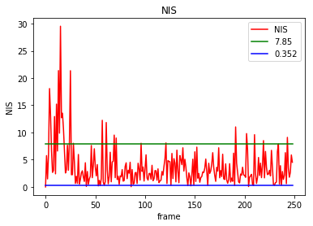
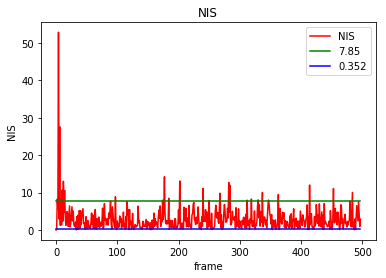
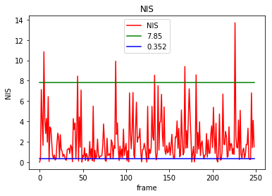

# Unscented Kalman Filter Project Starter Code

In this project utilize an Unscented Kalman Filter to estimate the state of a moving object of interest with noisy lidar and radar measurements. Passing the project requires obtaining RMSE values that are lower that the tolerance outlined in the project reburic. 

The goals / steps of this project are the following:

* Step 1: Initializing kalman filter matrices and vectors 
* Step 2: Predicting x state vector (px, py, vx, vy) and P state covariance matrix 
* Step 3: Updating predicted states based on sensor measurements
* Step 4: Calculating rmse
* step 5: plotting NIS values 

Goals:
* Utilizing kalman filter to estimate the state of a moving object with lidar and radar mesaurments
* Achieving low RMSE values  
* NIS 5% below 7.85
* NIS be between 0.35 and 7.81 in at least 80% of all radar update steps

### Build & Run Instruction
This project involves the Term 2 Simulator which can be downloaded [here](https://github.com/udacity/self-driving-car-sim/releases)

This repository includes two files that can be used to set up and install [uWebSocketIO](https://github.com/uWebSockets/uWebSockets) for either Linux or Mac systems. For windows you can use either Docker, VMware, or even [Windows 10 Bash on Ubuntu](https://www.howtogeek.com/249966/how-to-install-and-use-the-linux-bash-shell-on-windows-10/) to install uWebSocketIO. 

Once the install for uWebSocketIO is complete, the main program can be built and run by doing the following from the project top directory.

1. Clone this repo.
2. Make a build directory: `mkdir build && cd build`
3. Compile: `cmake .. && make` 
   * On windows, you may need to run: `cmake .. -G "Unix Makefiles" && make`
4. Run it: `./UnscentedKF `

### Report

#### Data 1

RMSE Both Sensors:
<table style="width:100%">
  <tbody border="1">
    <tr>
        <td></td>
        <td>px </td>
        <td>py </td>
        <td>vx </td>
        <td>vy </td>
    </tr>
    <tr>
      <th scope="row">UKF</th>
      <td>0.0883</td>
      <td>0.0938</td>
      <td>0.3791</td>
      <td>0.2794</td>
    </tr>
    <tr>
      <th scope="row">EKF</th>
      <td>0.0973</td>
      <td>0.0855</td>
      <td>0.4513</td>
      <td>0.4399</td>
    </tr>
  </tbody>
</table>

RMSE Laser Only:

<table style="width:100%">
  <tbody border="1">
    <tr>
        <td></td>
        <td>px </td>
        <td>py </td>
        <td>vx </td>
        <td>vy </td>
    </tr>
    <tr>
      <th scope="row">UKF</th>
      <td>0.1138</td>
      <td>0.0952</td>
      <td>0.6313</td>
      <td>0.2643</td>
    </tr>
    <tr>
      <th scope="row">EKF</th>
      <td>0.1222</td>
      <td>0.0984</td>
      <td>0.5825</td>
      <td>0.4567</td>
    </tr>
  </tbody>
</table>

RMSE Radar Only:
<table style="width:100%">
  <tbody border="1">
    <tr>
        <td></td>
        <td>px </td>
        <td>py </td>
        <td>vx </td>
        <td>vy </td>
    </tr>
    <tr>
      <th scope="row">UKF</th>
      <td>0.1747</td>
      <td>0.2646</td>
      <td>0.4365</td>
      <td>0.9429</td>
    </tr>
    <tr>
      <th scope="row">EKF</th>
      <td>0.1909</td>
      <td>0.2799</td>
      <td>0.4534</td>
      <td>0.6776</td>
    </tr>
  </tbody>
</table>

<table style="width:100%">
  <tr>
    <td>Simulator Both</td>
    <td>Simulator Laser only</td>
    <td>Simulator Radar only</td>
  </tr>
  <tr>
    <td></td>
    <td></td>
    <td></td>
  </tr>
  <tr>
<table>

<table style="width:100%">
  <tr>
    <td>NIS Both (87.37%)</td>
    <td>NIS Laser only (86.0%)</td>
    <td>NIS Radar only (83.53%)</td>
  </tr>
  <tr>
    <td></td>
    <td></td>
    <td></td>
  </tr>
  <tr>
<table>

#### Data 2

RMSE Both Sensors:

<table style="width:100%">
  <tbody border="1">
    <tr>
        <td></td>
        <td>px </td>
        <td>py </td>
        <td>vx </td>
        <td>vy </td>
    </tr>
    <tr>
      <th scope="row">UKF</th>
      <td>0.0871</td>
      <td>0.0940</td>
      <td>0.6393</td>
      <td>0.3240</td>
    </tr>
    <tr>
      <th scope="row">EKF</th>
      <td>0.0726</td>
      <td>0.0965</td>
      <td>0.4216</td>
      <td>0.4932</td>
    </tr>
  </tbody>
</table>

RMSE Laser Only:
<table style="width:100%">
  <tbody border="1">
    <tr>
        <td></td>
        <td>px </td>
        <td>py </td>
        <td>vx </td>
        <td>vy </td>
    </tr>
    <tr>
      <th scope="row">UKF</th>
      <td>0.1072</td>
      <td>0.0860</td>
      <td>0.5794</td>
      <td>0.2918</td>
    </tr>
    <tr>
      <th scope="row">EKF</th>
      <td>0.0961</td>
      <td>0.1003</td>
      <td>0.5418</td>
      <td>0.4640</td>
    </tr>
  </tbody>
</table>

RMSE Radar Only:
<table style="width:100%">
  <tbody border="1">
    <tr>
        <td></td>
        <td>px </td>
        <td>py </td>
        <td>vx </td>
        <td>vy </td>
    </tr>
    <tr>
      <th scope="row">UKF</th>
      <td>0.1973</td>
      <td>0.2548</td>
      <td>0.8227</td>
      <td>0.5441</td>
    </tr>
    <tr>
      <th scope="row">EKF</th>
      <td>0.2256</td>
      <td>0.2959</td>
      <td>0.5879</td>
      <td>0.7966</td>
    </tr>
  </tbody>
</table>

<table style="width:100%">
  <tr>
    <td>Simulator Both</td>
    <td>Simulator Laser only</td>
    <td>Simulator Radar only</td>
  </tr>
  <tr>
    <td></td>
    <td></td>
    <td></td>
  </tr>
  <tr>
<table>

<table style="width:100%">
  <tr>
    <td>NIS Both (84.13%)</td>
    <td>NIS Laser only (81.92%)</td>
    <td>NIS Radar only (86.34%)</td>
  </tr>
  <tr>
    <td></td>
    <td></td>
    <td></td>
  </tr>
  <tr>
<table>

#### Processing noises used in this project:

<table style="width:100%">
  <tr>
    <td>longitudinal acceleration</td>
    <td>yaw acceleration</td>
  </tr>
  <tr>
    <td>1.0</td>
    <td>0.15</td>
  </tr>
  <tr>
<table>

#### UKF Results:
UKF achieved approximately better results in dataset1 (~0.1) comparing to EKF, however results are pretty much similar to EKF in dataset2.

Radar-only results has higher RMSE values than Laser-only and both-sensor, which highlights the importance of lidar sensor information in kalman filters and moving objects estimations.

NIS values in all cases stay bewteen 82-87%, which is a good indication that uncertainty of system is not over/under estimated.

